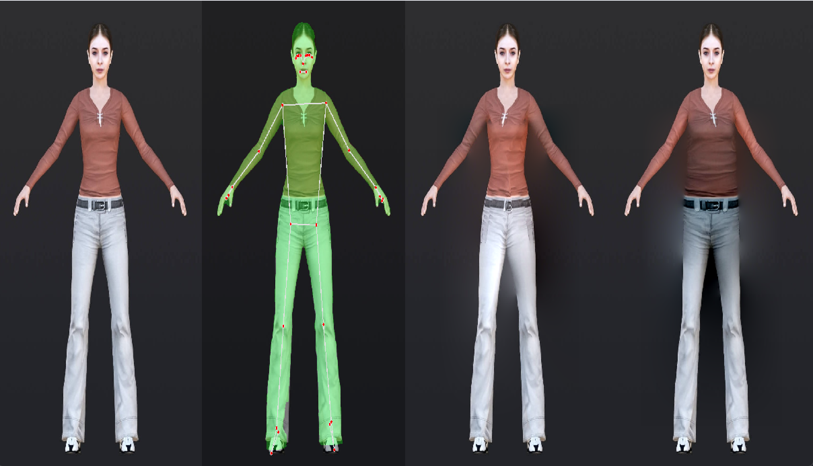
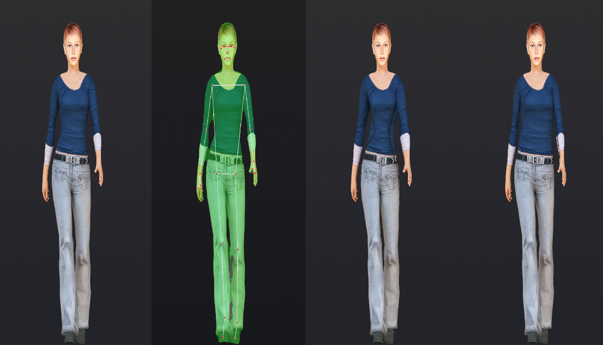
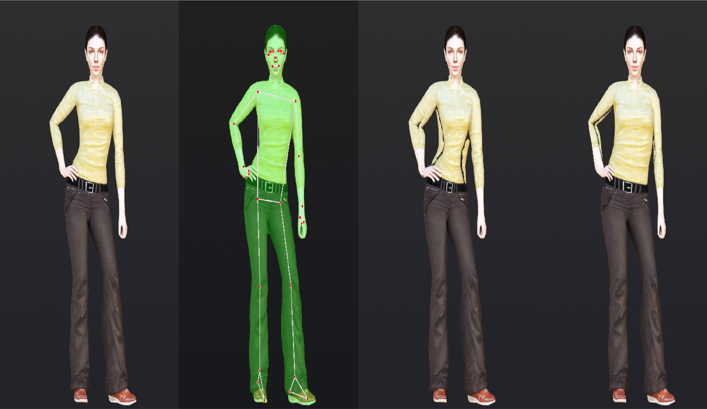

# body-shape-transform-prototypee

Fotoğraf üzerinde, segmentasyon ve geometrik deformasyon ile kilo değişimi simülasyonu.

## Özellikler

- İnsan vücut segmentasyonu
- Geometrik deformasyon ile vücut şekli değiştirme (kilo alma/verme simülasyonu)
- Gerçekçi görsel sonuçlar

## Kurulum

1. Bu repoyu klonlayın:
   ```powershell
   git clone https://github.com/kullanici/body-shape-transform-prototypee.git
   ```
2. Gerekli Python paketlerini yükleyin:
   ```powershell
   pip install -r requirements.txt
   ```
   (Not: `requirements.txt` dosyanız yoksa, kullandığınız kütüphaneleri belirtin.)

## Kullanım

1. `data/images/` klasörüne işlemek istediğiniz fotoğrafları ekleyin.
2. Segmentasyon için:
   ```powershell
   python scr/segment.py --input data/images/human-model11.jpg --output data/segmented/
   ```
3. Geometrik deformasyon için:
   ```powershell
   python scr/transform.py --input data/segmented/human-model11_segmented.jpg --output data/transformed/
   ```
4. Sonuçları `data/transformed/` klasöründe bulabilirsiniz.

## Ekran Görüntüleri

Aşağıda uygulamanın örnek çıktılarına ait ekran görüntülerini bulabilirsiniz:
<div align="center">

   <br>


</div>

## Dosya Yapısı

- `scr/segment.py`: Segmentasyon işlemleri
- `scr/transform.py`: Geometrik deformasyon işlemleri
- `scr/blend.py`: Görüntü birleştirme yardımcı fonksiyonları
- `data/images/`: Girdi fotoğrafları
- `data/screenshots/`: Ekran görüntüleri

## Katkı

Katkıda bulunmak isterseniz, lütfen bir issue açın veya pull request gönderin.

## Lisans

Bu proje MIT lisansı ile lisanslanmıştır.
